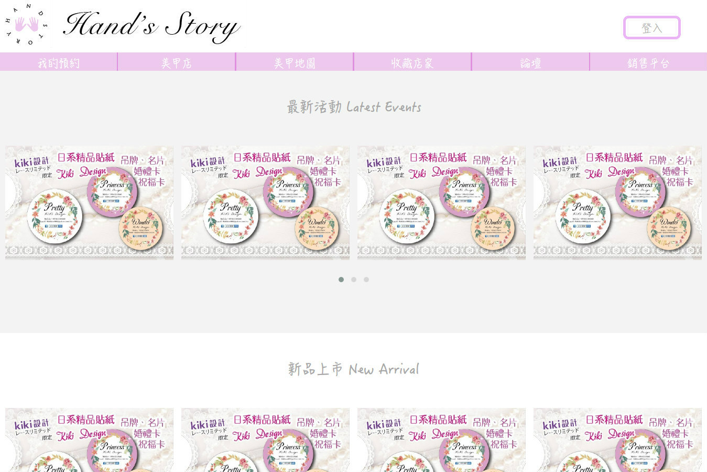
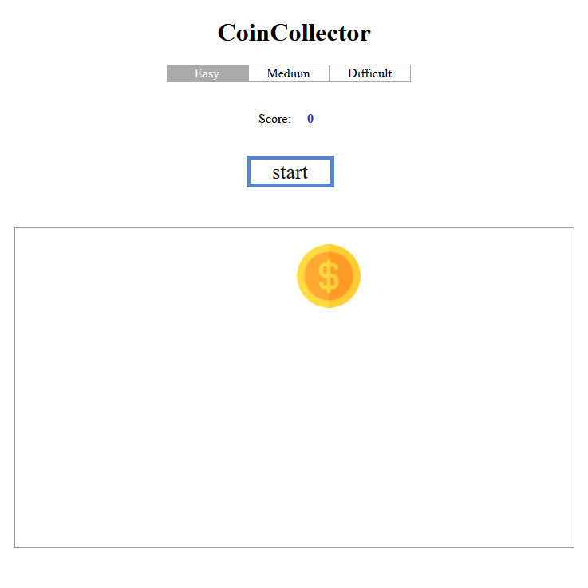
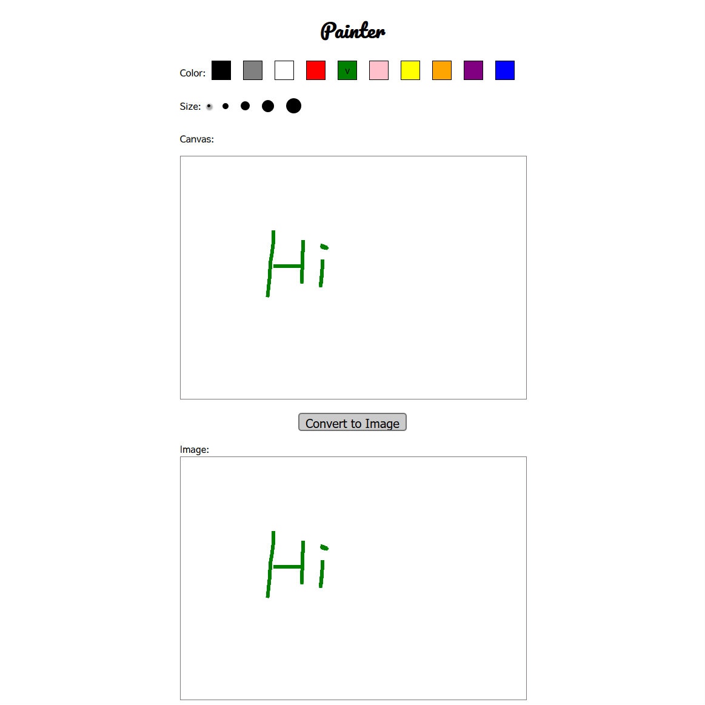
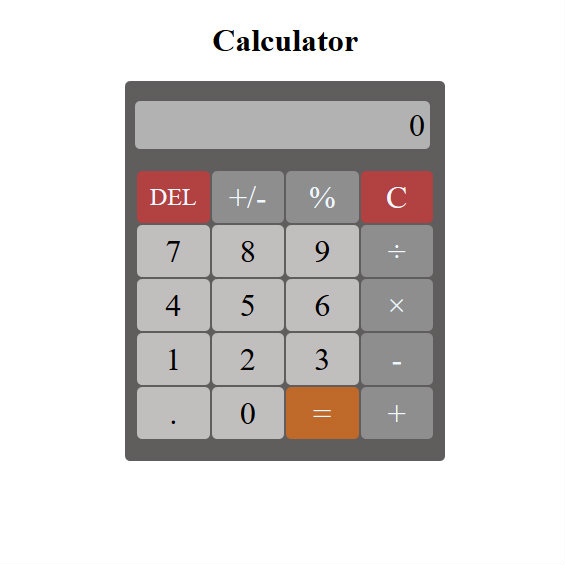
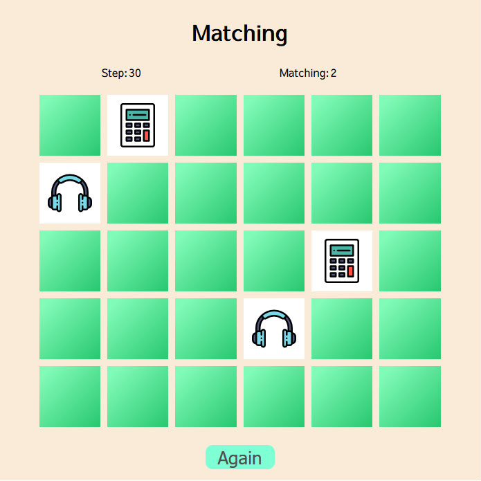
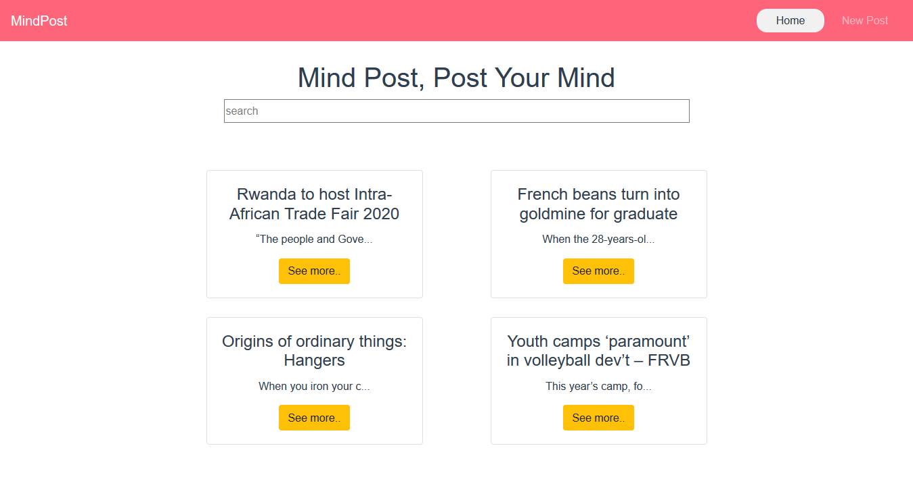
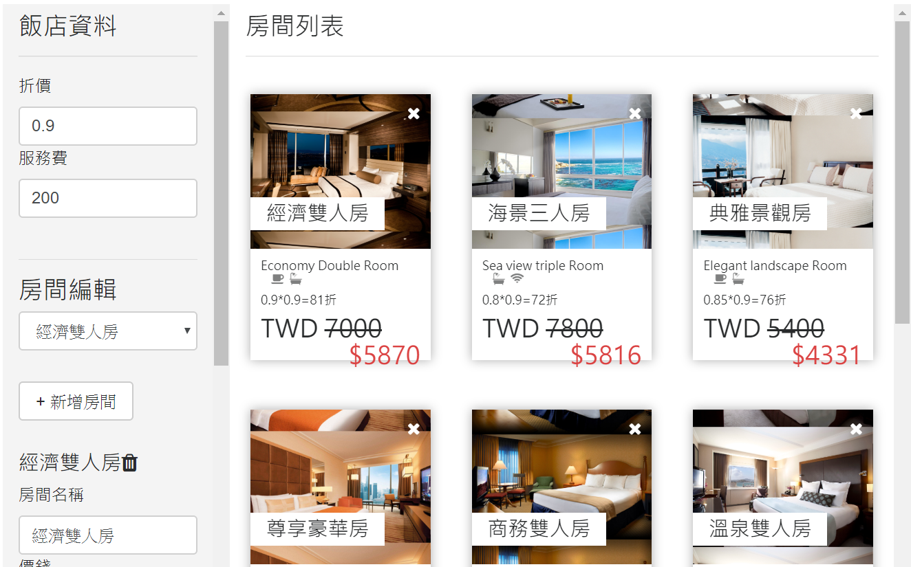
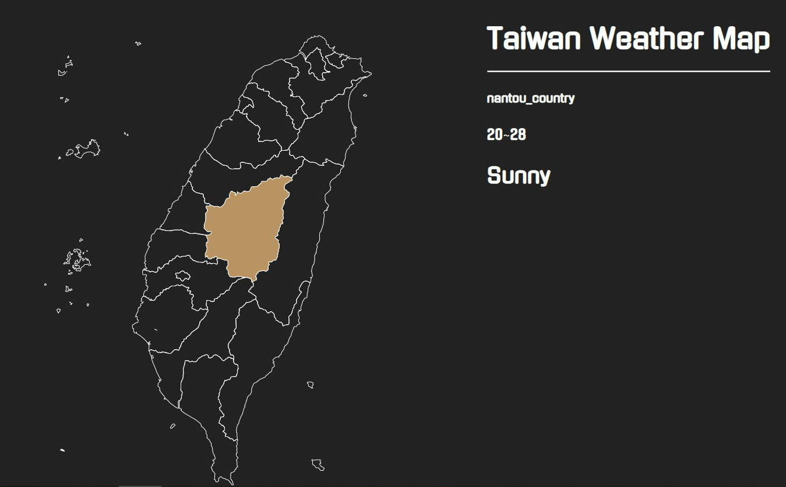

<link rel="stylesheet" type="text/css" href="./style.css">
<h3>2017.01-2018.06 畢業專案</h3>

  

<strong>HandStory(美甲資訊整合平台) / 前端開發</strong>

電腦版:php+html+css+jquery
    手機版:php+Jquery mobile(html/css/jquery)
   

    
負責工作:
<ul><li>web/行動/平板前端開發(html/css/jquery)</li><li>資料庫規劃及建置(mysql)</li><li>串接前後端</li></ul>
    
<a href="https://github.com/HsinShan/Handstory/blob/master/README.md">DEMO</a><a href="https://github.com/HsinShan/Handstory">原始碼</a>

<h3>自學 自製專案</h3><h5>RWD </h5>

<strong>BagStore / 包包電商網站</strong>

RWD+CSS animation
   

 <a href="https://hsinshan.github.io/Portfolio/Bag/">DEMO</a><a href="https://github.com/HsinShan/Portfolio/tree/master/Bag">原始碼</a>

    

<strong>HappyTravel Club / 旅行社網站</strong>

Html+CSS+Javascript+Bootstrap
   

 <a href="https://hsinshan.github.io/Portfolio/HappyTravel Club/">DEMO</a><a href="https://github.com/HsinShan/Portfolio/tree/master/HappyTravel%20Club">原始碼</a>

   

<h5> 一天一主題 in five days -- Javascript </h5>

<strong>Coincollector</strong>

 <a href="https://hsinshan.github.io/DailyChallenge/CoinCollector.html">DEMO</a><a href="https://github.com/HsinShan/DailyChallenge/blob/master/CoinCollector.html">原始碼</a>

    

<strong>BombNumber</strong>

 <a href="https://hsinshan.github.io/DailyChallenge/bombnumber.html">DEMO</a><a href="https://github.com/HsinShan/DailyChallenge/blob/master/bombnumber.html">原始碼</a>

  
    

<strong>Painter</strong>

 <a href="https://hsinshan.github.io/DailyChallenge/painter.html">DEMO</a><a href="https://github.com/HsinShan/DailyChallenge/blob/master/painter.html">原始碼</a>

    

<strong>Calculator</strong>

 <a href="https://hsinshan.github.io/DailyChallenge/calculator.html">DEMO</a><a href="https://github.com/HsinShan/DailyChallenge/blob/master/calculator.html">原始碼</a>

   
    

<strong>Matching</strong>

 <a href="https://hsinshan.github.io/DailyChallenge/matching.html">DEMO</a><a href="https://github.com/HsinShan/DailyChallenge/blob/master/matching.html">原始碼</a>

  

<h5>Vue </h5>

<strong>Blog</strong>

Vue.js+Firebase
   

<a href="https://github.com/HsinShan/Portfolio/tree/master/blog">原始碼</a>

    

<strong>飯店管理系統</strong>

 <a href="https://codepen.io/ShirleyHsieh/pen/bJPboe">DEMO</a>

   

<h5>Others</h5>

<strong>Weather</strong>

<a href="https://codepen.io/ShirleyHsieh/pen/LoEvZa">DEMO</a>

  

